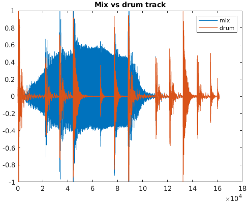
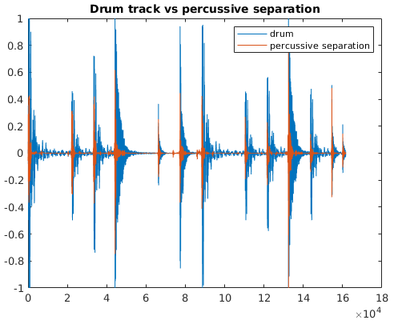
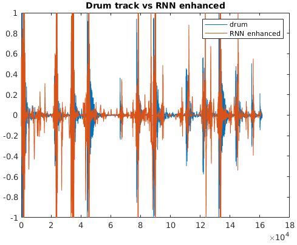
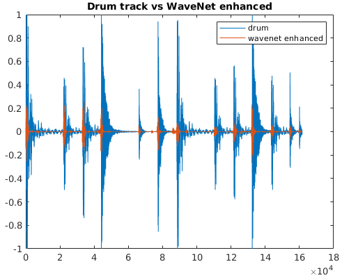
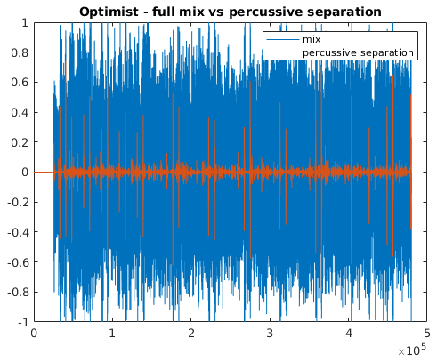
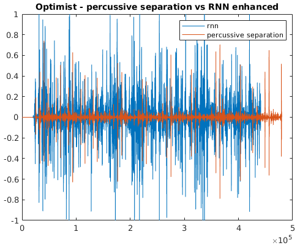
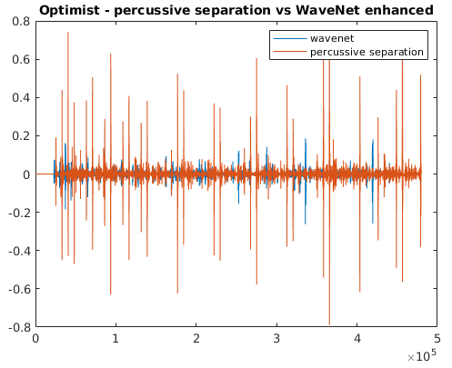

### neural drum enhancer

2 attempts at writing a drum-track enhancer.

Input: the inputs are percussive separations from median-filtering harmonic-percussive source separation. You can view some of my previous work on harmonic-percussive source separation:
* [Real-Time HPSS](https://github.com/sevagh/Real-Time-HPSS)
* [Zen](https://github.com/sevagh/Zen)

You can also view the [reference Mathworks MATLAB implementation](https://www.mathworks.com/help/audio/ug/time-frequency-masking-for-harmonic-percussive-source-separation.html), or use the [librosa functions](https://librosa.org/doc/main/generated/librosa.decompose.hpss.html) in Python.

These sound perceptually thin and have musical artifacts from the HPSS process. My goal is to create a neural model which transforms the thin, poor-sounding percussive separations into a waveform that more closely resembles or sounds like the real drum track.

#### Example - simple mix

Audio clips (same examples used in Real-Time-HPSS and Zen):

* 
* 
* 
* 
* 

Waveform visualized:

#### Example - real song
Simple example waveforms (truncated to first 10 seconds) all come from [Misha Mansoor & Tosin Abasi - Optimist](https://www.youtube.com/watch?v=T4gTgM0UepQ):

* 
* , or the input to our neural network
* , or the output of the RNN enhancer
* , or the output of the WaveNet enhancer

Waveform visualized:

### Training data

The training data used are Periphery stems (purchased from their website), preprocessed as such:

* Using `prepare_data.py`, the stems are grouped by song, summed to make a mix, have HPSS applied on the mix to make a percussive separation, and finally have the percussive separation set as an input and the clean drum track set as an output
* Using `rnn_wav_to_hdf5.py`, the input/output pairs are transformed into 24 BFCC coefficients each from overlapping frames
* Using `wavenet_wav_to_hdf5.py`, the input/output pairs are transformed 512 waveform values each from overlapping frames

**NB**: As a simplifying assumption for both models, I assume that every pair of training datum is independent. I.e. I don't consider sequences of frames, but _m_ x 48 individual rows (24 BFCCs in/out), or _m_ x 1024 individual rows (512 sample waveform in/out). This lets me avoid the issue of temporal patterns in audio (but can be a wrong assumption that's one of the causes of the poor quality of my results).

Sample single testcase (mix -> percussive separation, drum):

Example testcases:

* 
* 
* 

There are 36 songs in total (representing 4 albums of music, or roughly 2 hours and 45 minutes of music). Split into 512- or 1024-sized frames, this creates plenty of testcases for training a neural network (although not necessarily "enough").

### RNN model - inspired by RNNoise

The RNN model is based heavily on RNNoise. BFCC coefficients are compared so that a "BFCC gain" is applied to the input percussive separation to produce it into a drum track.

This should have the effect of boosting the critical bands where the original drum track had more energy, and reducing the bands where the original drum track was silent. In this, I anticipated the RNN model to behave like a noise-gate and transient enhancer hybrid.

#### Challenges

1. Unclear how to best apply critical band gain (open question [here](https://dsp.stackexchange.com/questions/71684/how-to-apply-cepstrum-coefficient-gains-bfcc-mfcc-to-an-input-signal)). I settled for multiplying the DFT bins that exist inside the respective Bark critical band by the band gain (which I know to be incorrect). Potential ideas here: https://github.com/stephencwelch/Perceptual-Coding-In-Python/blob/master/BarkClass/Bark.py
2. In RNNoise, gains are capped between 0 and 1 so that audio that doesn't exist isn't created. I don't have this limitation (therefore I have some real perceptual problems, since you can't simply "make a drum sound" with some gain)

### WaveNet model - inspired by WaveNet

My next attempt was to use direct waveforms the way WaveNet does. Again, as I'm not trying to enforce causal or temporal dependencies as in the original paper, I use a simpler model that only compares 512 samples to 512 samples (assuming overlapping waveform inputs of frame size 512, hop size 256).

Instead of applying gain on a bad waveform, it could instead "learn" how a bad percussive-separated waveform maps to the clean drum track equivalent.
